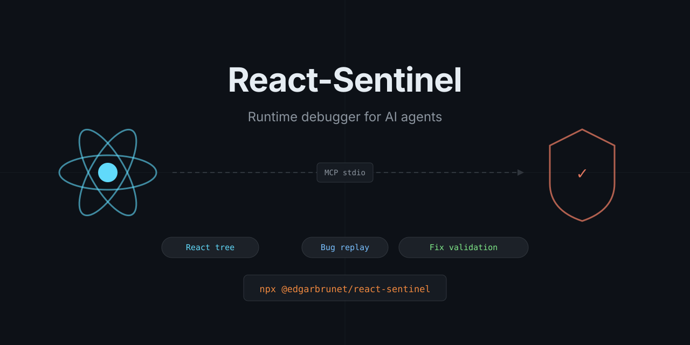

# React-Sentinel

<p align="center">
  
</p>

> Give AI agents a runtime debugger for React apps: inspect live state, reproduce bugs, and validate fixes before editing code.

React-Sentinel is an MCP server for AI coding agents and IDE assistants. Instead of guessing from source code alone, the agent can connect to a live browser session, inspect React runtime data, replay user flows, and turn observations into assertions.

## Why it exists

Most AI coding tools can edit code quickly, but they still struggle to answer simple runtime questions:

- Which prop or state value keeps this button disabled?
- Did the UI fail because React rendered the wrong branch, or because the API returned bad data?
- Does a proposed fix actually work in the browser before the agent edits the repository?

React-Sentinel closes that gap by exposing a browser runtime through MCP.

## Core capabilities

| Capability | What it gives the agent |
|---|---|
| **Runtime inspection** | React tree, component props, selected hook values, context values, render signals |
| **Replay reproduction** | An isolated Playwright browser for deterministic bug reproduction |
| **Live attach** | Optional reuse of a real Chrome tab when the bug depends on existing user state |
| **Assertions** | Structured pass/fail checks for DOM, React state, console output, and network activity |
| **Shadow sandbox** | Runtime-only patch validation in replay mode before touching source files |

## Quick start

React-Sentinel is being prepared for public npm distribution under **`@edgarbrunet/react-sentinel`**. That is the only public npm package name documented by this repository.

### Public npm command

When the scoped package is available, the recommended public command is:

```bash
npx -y @edgarbrunet/react-sentinel init-mcp --client auto --mode npx
```

Use `--write` when the target environment has a well-known project or user config path:

```bash
npx -y @edgarbrunet/react-sentinel init-mcp --client claude-code --mode npx --write
npx -y @edgarbrunet/react-sentinel init-mcp --client cursor --mode npx --write
npx -y @edgarbrunet/react-sentinel init-mcp --client github-copilot --mode npx --write
```

### Local checkout flow

If you are running from this repository checkout before public publication:

```bash
npm install
npm run build
node dist/index.js init-mcp --client auto --mode local
```

## Supported environments

| Environment | Status | Recommended setup |
|---|---|---|
| **Claude Code** | Supported | `init-mcp --client claude-code --mode npx --write` or `--mode local` from a checkout |
| **Claude Desktop** | Supported | `init-mcp --client claude-desktop --mode npx --write` |
| **Cursor** | Supported | `init-mcp --client cursor --mode npx --write` |
| **GitHub Copilot / VS Code** | Supported | `init-mcp --client github-copilot --mode npx --write` |
| **Gemini CLI** | Supported | `init-mcp --client gemini-cli --mode npx --write` |
| **Generic MCP clients** | Supported manually | `init-mcp --client generic-mcp --mode npx` then paste the snippet manually |
| **Other IDE integrations** | Partial | Reuse the generic MCP command and adapt the client-specific config shape |

See the full setup instructions in [docs/universal-install.md](docs/universal-install.md) and the per-environment guide in [docs/integration-guides.md](docs/integration-guides.md).

## When to use React-Sentinel

Use it when the agent must understand what the app is doing at runtime, not just what the source code suggests.

- a React bug depends on real state, props, or context;
- the UI diverges from expected behavior after user interactions;
- console or network signals may explain the failure faster than static reading;
- the agent wants to validate a fix hypothesis in replay mode before editing source files.

For runtime workflows and prompt examples, see [docs/agent-runtime-ux.md](docs/agent-runtime-ux.md) and [docs/workflows.md](docs/workflows.md).

## Install modes

React-Sentinel keeps the CLI binary name `react-sentinel`, but the public npm package name is scoped.

| Mode | Best when | Launch shape |
|---|---|---|
| **local** | You are running from this checkout or a local package install | `node /absolute/path/to/dist/index.js mcp --headless` |
| **global** | You installed the CLI binary globally yourself | `react-sentinel mcp --headless` |
| **npx** | You want a client to fetch the public package on demand | `npx -y @edgarbrunet/react-sentinel mcp --headless` |

## Product docs

- [docs/universal-install.md](docs/universal-install.md) — package naming, install modes, target selection, limitations
- [docs/integration-guides.md](docs/integration-guides.md) — Claude, Cursor, Copilot, Gemini, and generic MCP setup guides
- [docs/agent-runtime-ux.md](docs/agent-runtime-ux.md) — trigger heuristics, mode choice, and example agent prompts
- [docs/adoption-checklist.md](docs/adoption-checklist.md) — onboarding checklist and validation scenarios
- [docs/local-ports.md](docs/local-ports.md) — legitimate local URLs, ports, and CDP endpoints used in docs and tests
- [docs/public-readiness-audit.md](docs/public-readiness-audit.md) — Sprint 15 audit of public-repo cleanup decisions
- [docs/workflows.md](docs/workflows.md) — deep workflow reference for Attach, Replay, Sandbox, and MCP wiring
- [docs/local-diagnostics-checklist.md](docs/local-diagnostics-checklist.md) — troubleshooting

## Local development

### Requirements

- Node.js 20+
- npm (or pnpm if you prefer workspace tooling)
- Playwright Chromium for replay mode

### Build and validate

```bash
npm install
npm run check
npm run build
cd examples/test-app && npm install && npm run build
```

If Playwright Chromium is missing:

```bash
npx playwright install chromium
```

### Start the server locally

```bash
node dist/index.js mcp --headless
```

### Run the smoke benchmark

```bash
npm run e2e:smoke
```

## Project structure

```text
src/                 CLI, MCP server, runtime tools
docs/                Public product and workflow documentation
assets/agent-pack/   Reusable agent-pack assets and profile guidance
examples/test-app/   Local demo app and validation fixture
```

## Current limits

- Live attach still depends on Chrome remote debugging.
- Shadow sandbox currently validates runtime-only script patches in replay mode, not full source rewrites.
- Some agent environments share the same MCP transport but differ in config shape, prompt UX, and restart behavior.
- Public npm publication and visibility changes remain gated by manual release checks.
